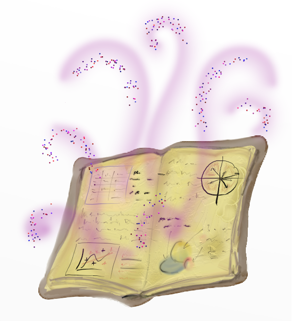
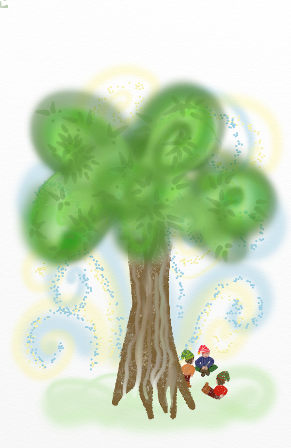
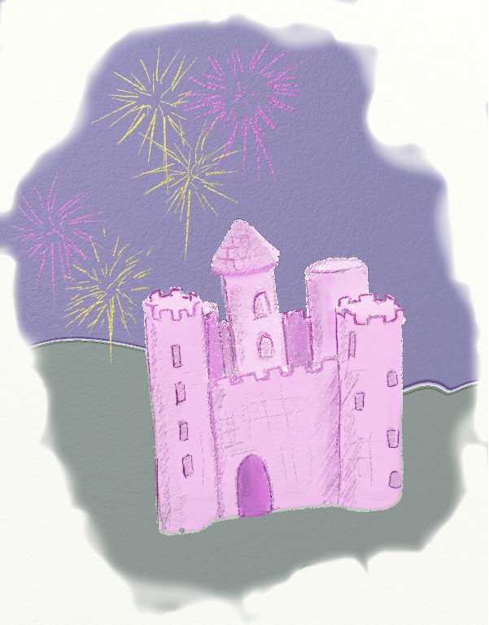
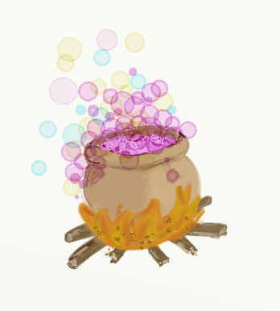

# Introduction {#intro}

```{r,echo=FALSE, message=FALSE, warning=FALSE}
library(tidyverse)
library(gridExtra)
library(purrr)
library(magrittr)
library(gganimate)
source("scripts/utils.R")
knitr::opts_chunk$set(echo = TRUE, message=FALSE, warning=FALSE)
```

## Pourquoi ce livre?




R a d'abord été conçu comme logiciel de statistiques. Sa richesse, en terme de modèles stats, est indéniable. Cependant, malgré (ou peut-être à cause de) cette richesse et de l'hétérogénéité des packages dédiés aux analyses statistiques, il peut être assez compliqué de s'y retrouver, d'un point de vue purement pratique, dans les lignes de commande permettant d'arriver à ses fins... En effet, pour produire l'ensemble d'une analyse, on aura la plupart du temps de combiner des commandes de plusieurs types (certaines pour produire un graphique, d'autres pour ajuster un modèle, etc.)

Ce livre peut ainsi servir d'**aide-mémoire** pour retrouver plus facilement les lignes de commande permettant de réaliser les différentes étapes des analyses les plus "classiques".

Au-delà de cet aspect plus logistique, les statistiques sont un sujet épineux qu'il peut être compliqué de s'approprier si l'on a pas le "parcours académique" adéquat... Or nombreuses sont les personnes qui ont besoin de comprendre et d'appliquer des modèles statistiques, sans pour autant avoir eu une formation de base à cette discipline (ou même sans avoir les notions de probabilités mises en jeu). Or, sans cette formation de base, il est délicat d'appliquer un modèle, de le comprendre et d'avoir le recul nécessaire pour interpréter les résultats de ce modèle...

Ce livre vise ainsi à **introduire les modèles statistiques et leurs applications** en reprenant et en explicitant les **notions de probabilités et statistiques** sous-jacentes de la manière la plus **didactique** et **accessible** possible.

## Packages

### Usage du tidyverse

<table>
<col width="150">
<col width="300">
<tr>
<td></td>
<td> En terme de **data wrangling** (ou **arrangement de données** dans la langue de Molière) j'ai pris l'habitude d'utiliser les packages du tidyverse (ggplot2, dplyr, tidyr, ...), qui sont très bien conçus et facilitent beaucoup de tâches... Je priviligierai donc les fonctions du **tidyverse** plutôt que les commandes de base quand c'est possible.</td>
</tr>
</table>


Ainsi, avant d'essayer de reproduire toute autre ligne de commande dans ce livre, il faudra (installer et) charger le tidyverse:

```{r chargement_tidyverse, eval=FALSE}
install.packages("tidyverse") # installation (si nécessaire)
library(tidyverse) # chargement
```

Voici les quelques packages du tidyverse que j'utiliserai le plus:

<table>
<col width="150">
<col width="300">
<tr>
<td></td>
<td>`ggplot2` pour **produire les graphiques**. Dans ce livre, je me servirai très souvent des fonctions de de package pour produire les graphiques (en fait, j'ai essayé, autant que possible, de ne me servir que de ce package pour produire les graphiques statistiques dans cet ouvrage). Vous pouvez en apprendre plus sur ce sujet sur [ce billet de blog](https://perso.ens-lyon.fr/lise.vaudor/par-ici-les-beaux-graphiques-avec-ggplot2/) et disposer d'un aide-mémoire [ici](https://github.com/rstudio/cheatsheets/blob/master/data-visualization-2.1.pdf).</td>
</tr>
<tr>
<td></td>
<td>`dplyr` pour **manipuler et transformer les tables**. Dans ce livre, je m'en sers très souvent, notamment pour calculer des statistiques descriptives par groupe. Vous pouvez en apprendre plus sur ce sujet sur [ce billet de blog](https://perso.ens-lyon.fr/lise.vaudor/dplyr/) et disposer d'un aide-mémoire[ici](https://github.com/rstudio/cheatsheets/blob/master/data-transformation.pdf). </td>
</tr>
<tr>
<td></td>
<td>`purrr` pour **simplifier l'écriture de procédures itératives**. Dans ce livre, je m'en sers notamment pour faire quelques simulations, ajuster quelques modèles de manière itérative... Vous n'en aurez pas forcément besoin pour comprendre les analyses détaillées mais si vous souhaitez en savoir plus à ce sujet vous pouvez aller voir [ce billet de blog](http://perso.ens-lyon.fr/lise.vaudor/iterer-des-fonctions-avec-purrr/) et disposer d'un aide-mémoire[ici](https://github.com/rstudio/cheatsheets/blob/master/purrr.pdf)</td>
</tr>
</table>


### Autres packages

J'utilise un certain nombre d'autres packages:


<table>
<col width="150">
<col width="300">
<tr>
<td></td>
<td>`janitor` pour [**nettoyer les données**](https://github.com/sfirke/janitor/blob/master/vignettes/janitor.md) et **mettre en forme des tableaux d'effectifs**(https://github.com/sfirke/janitor/blob/master/vignettes/tabyls.md).</td>
</tr>
<tr>
<td></td>
<td>`infer` pour réaliser des **tests statistiques** selon la logique `tidyverse`, aider à leur compréhension, et à la réalisation des **tests par permutation**... [Package tout récent!](https://github.com/andrewpbray/infer)</td>
</tr>
</table>


### Illustrations

Je me suis amusée à créer quelques illustrations pour cet ouvrage, à l'aide du merveilleux logiciel [ArtRage](https://www.artrage.com/). Au cas où, je précise que j'ai fait ça sur mon temps libre et non mes heures de travail ;-) ...

Les illustrations servent à **rompre la monotonie (formelle)** de cet ouvrage (car, oui, malgré le nombre de graphiques statistiques qu'il contient, j'ai bien peur, du fait de sa taille, qu'il puisse être indigeste si on l'appréhende en un bloc...) et à servir de **points de repère visuels**. Et puis, solliciter un tout petit peu l'imagination par des images, ça favorise la mémorisation et l'apprentissage.    

## Jeux de données

### Des jeux de données fictifs

Dans ce livre, j'utiliserai (presque) exclusivement des jeux de données **fictifs**, pour une question de facilité et de souplesse... Cela me permettra en effet d'avoir des jeux de données **intuitifs** qui limiteront l'effort à fournir pour le lecteur pour comprendre ce qu'est telle ou telle variable. En effet, je veux me concentrer sur l'explication de la **méthode**, pas sur l'explication thématique... Par ailleurs, cela me permet de disposer de données de tous les **types, distributions, tailles d'échantillon**, etc. qu'il me faut pour expliquer un **très large éventail de méthodes statistiques**.

Utiliser des jeux de données fictifs, cela va aussi me permettre de prendre des exemples les plus **universels** possibles... En effet, si je prenais des exemples réels issus d'une discipline particulière (par exemple, tout-à-fait au hasard, la géomorphologie fluviale), ça ne serait pas particulièrement parlant pour les personnes d'une autre discipline (par exemple, la psychologie)... Alors que tout le monde peut se projeter dans les histoires de chevaliers, de magicien(ne)s, et de prince(sse)s :-). 

Soyons clairs néanmoins: avoir des *bons* jeux de *vraies* données pour expliquer une méthode, c'est super, ça permet de vraiment comprendre les problèmes auxquels on est confrontés dans la "vraie" vie (par exemple les données manquantes, le peu de données, la non-normalité), mais c'est **très contraignant** et c'est **beaucoup de travail** (trouver un jeu de donnée "open" et ad hoc pour chaque méthode, le rendre facilement accessible et compréhensible...) et ce n'est donc pas le choix que j'ai fait pour cet ouvrage.

### Brocéliande

<table>
  <col width="150">
  <col width="300">
<tr><td>
</img>
</td>
<td>
Le jeu de données `broceliande` recense (en terme d'individus) un certain nombre d'arbres de la forêt de Brocéliande ainsi que (en terme de variables):

- `age`: leur âge, en années
- `espece`: leur espèce (chêne, châtaignier, hêtre ou sapin)
- `hauteur`: leur hauteur, en cm
- `largeur`: leur largeur, en cm
- `gui`: le nombre de touffes de gui qui les affecte 
- `enchantement`: la présence d'un enchantement sur cet arbre (TRUE ou FALSE)
- `fees`: le nombre de fées qui habitent cet arbre
- `lutins`: le nombre de lutins qui habitent cet arbre
- `perlimpinpin`: la quantité de poudre de perlimpinpin dans sa sève (en $\mu$g/L)

</td></tr></table>

Le jeu de données `broceliande` est disponible en ligne [à cette adresse](datasets/broceliande.csv).

```{r broceliande_pres}
broceliande=read.csv("http://perso.ens-lyon.fr/lise.vaudor/grimoireStat/datasets/broceliande.csv",
                     header=TRUE,sep=";")
str(broceliande)
```

### Châteaux et Boulots

<table>
  <col width="150">
  <col width="300">
<tr><td>
</img>
</td>
<td>
Le jeu de données `chateauxEtBoulots` recense (en terme d'individus) un certain nombre de personnes du pays Fantaisie ainsi que (en terme de variables) 

- `activite`: leur activité (la royauté, la chevalerie, les enchantements ou la magie noire), 
- `sexe`: leur sexe (féminin ou masculin),
- `region`: leur région (Bois-Jolis,Montage-Sombre ou Flots-Blancs) 
- `tenue`: leur couleur de tenue (noire, grise, bleue, verte, ou rose).

</td>
</tr>
</table>


Le jeu de données `chateauxEtBoulots` est disponible en ligne [à cette adresse](datasets/chateauxEtBoulots.csv).

```{r chateauxEtBoulots_pres}
chateauxEtBoulots=read.csv("http://perso.ens-lyon.fr/lise.vaudor/grimoireStat/datasets/chateauxEtBoulots.csv",
                           header=TRUE, sep=";")
str(chateauxEtBoulots)
```

### Potions

<table>
  <col width="150">
  <col width="300">
<tr><td>
</img>
</td>
<td>

Le jeu de données `potions` recense un certain nombre de potions magiques ainsi que pour lesquelles sont renseignées

- des **quantités d'ingrédients** (noms de variables commençant par `i_`)
- des **scores relatifs aux propriétés magiques** des potions (noms de variables commençant par `p_`)
- des **modalités d'élaboration des potions** (noms de variables commençant par `p_`)
</td>
</tr>
</table>

Parmi les **ingrédients**, on peut citer par exemple ailes de papillon, bave de crapaud, pierre de lune, etc.

En terme de **propriétés** on a relevé si les potions permettent 

- d'altérer l'apparence, de se transformer en loup-garou ou en plante verte (`altération`) - de conjurer des esprits ou des morts-vivants (`conjuration`)
- de lancer des éclairs, des boules de feu ou des pics de glace (`destruction`)
- de devenir invisible (`invisibilite`)
- de se protéger des attaques (`resistance`)? 

Quant aux modalités d'élaboration des potions, elles décrivent la nécessité d'une formule ou non, et si oui, et en quelle langue (elfique ou latin). La préparation peut être effectuée par bouillon, macération ou distillation.


Le jeu de données `potions` est disponible en ligne [à cette adresse](datasets/potions.csv).

```{r}
potions=read.csv("http://perso.ens-lyon.fr/lise.vaudor/grimoireStat/datasets/potions.csv",
                 sep=";", header=T)
str(potions)
```

## Rappels

Quelques rappels des fonctions de bases pour décrire ses données

### Décrire un tableau

Affichage des **dimensions**, **nombre de lignes**, **nombre de colonnes** :

```{r broceliande_dimensions}
dim(broceliande)
nrow(broceliande)
ncol(broceliande)
```

**Affichage** des premières lignes, ou dernières lignes ou de l'ensemble du tableau dans le "Viewer" de RStudio:

```{r broceliande_head_tail}
head(broceliande)
tail(broceliande)
```

Affichage de la **structure**, d'un **résumé de la distribution** des variables du tableau:

```{r broceliande_structure}
str(broceliande)
summary(broceliande)
```


### Décrire vecteur numérique

#### par une métrique

**Longueur** du vecteur:


```{r broceliande_longueur_vecteur}
length(broceliande$hauteur)
```

**Minimum**, **maximum**, **étendue** d'un vecteur

```{r broceliande_etendue}
min(broceliande$hauteur)
max(broceliande$hauteur)
range(broceliande$hauteur)
```

Tendance centrale: **moyenne**, **médiane**:

<div class="encadre">
La moyenne d'une variable $X$ (ou espérance, $E(X)$) correspond à:

\begin{eqnarray}
E(X) &=&\frac{1}{N}(X_1+X_2+....+X_N)\\
&=&\frac{1}{N}\sum_{i=1}^{i=N}{X_i}
\end{eqnarray}

</div>


```{r broceliande_tendance}
mean(broceliande$hauteur)
median(broceliande$hauteur)
```

Variabilité: **écart-type**, **variance**:

<div class="encadre">
La variance d'une variable ($V(X)$) correspond à:

\begin{eqnarray}
V(X)&=&\frac{1}{N-1}[(X_1-\bar X)^2+...+(X_N-\bar X)^2]\\
&=& \frac{1}{N-1}\sum_{i=1}^{i=N}(X_i-\bar X)^2\\
&=& sd(X)^2
\end{eqnarray}
</div>

```{r broceliande_variabilite}
sd(broceliande$hauteur)
var(broceliande$hauteur)
```

Distribution: **quantiles**, **résumé**

<div class="encadre">
Le quantile d'ordre $q$ d'une variable $X$ est la valeur $x$ telle que :

$$pr(X\leq x)=q$$.
</div>

On parle de premier, deuxième, et troisième **quartiles** pour les quantiles d'ordre 0.25, 0.5, et 0.75.

Le deuxième quartile est en outre équivalent à la médiane.


```{r broceliande_distrib}
quantile(broceliande$hauteur,0.05)
quantile(broceliande$hauteur,c(0.05,0.95))
summary(broceliande$hauteur)
```

Si le nombre de valeurs différentes est limité, affichage des **effectifs par valeur**:

```{r broceliande_table_fees}
table(broceliande$fees)
```

ou bien par les fonctions du tidyverse (ici package `dplyr`):

```{r  broceliande_effectifs_fees}
broceliande %>% 
  group_by(fees) %>% 
  summarise(n=n())
```


#### par un graphique

```{r broceliande_histogramme_hauteur, fig.width=4, fig.height=3}
ggplot(broceliande, aes(x=hauteur))+
  geom_histogram(fill="forestgreen")
```


### Décrire un vecteur catégoriel:

#### par une métrique

**Longueur** du vecteur:

```{r broceliande_longueur_espece}
length(broceliande$espece)
```

Affichage des **effectifs par valeur**:

```{r broceliande_table_espece}
table(broceliande$espece)
```

ou bien par les fonctions du tidyverse (ici package `dplyr`):

```{r borceliande_effectifs_espece}
broceliande %>% 
  group_by(espece) %>% 
  summarise(n=n())
```

Le package [`janitor`](https://github.com/sfirke/janitor/) propose également quelques fonctions qui permettent d'"arranger" plus facilement ces tables d'effectifs en tables de **proportions** (avec quelques infos supplémentaires -fonctions adorn_xxx()-):

```{r janitor_formatting}
##install.packages("janitor")
library(janitor)
tabyl(broceliande$espece) %>% 
  adorn_pct_formatting() %>% # rajoute pourcentage
  adorn_totals("row")        # rajoute total des lignes
```

#### par un graphique

```{r broceliande_bar_espece, fig.width=4, fig.height=3}
ggplot(broceliande,aes(x=espece))+
  geom_bar(fill="greenyellow")
```

