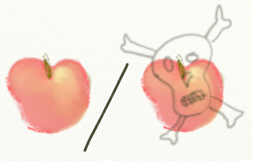
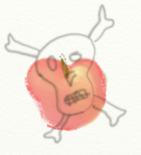
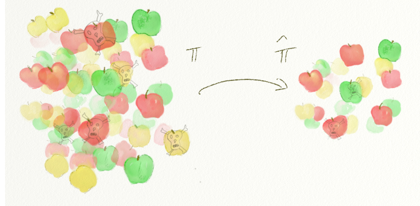
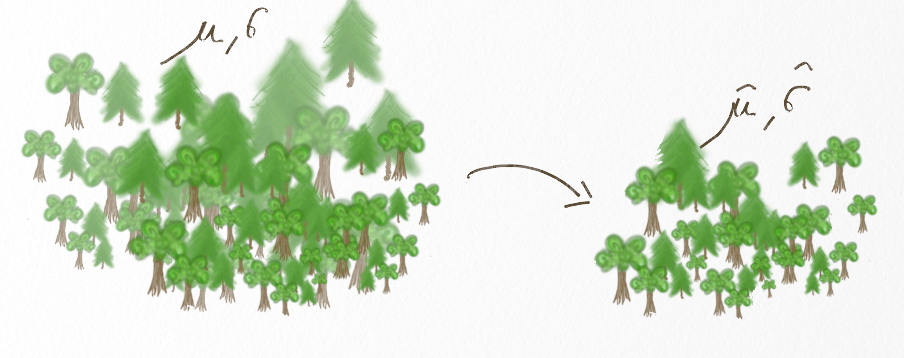

# Décrire une variable

```{r,echo=FALSE, message=FALSE, warning=FALSE}
library(tidyverse)
library(gridExtra)
library(purrr)
library(magrittr)
library(gganimate)
source("scripts/utils.R")
knitr::opts_chunk$set(echo = TRUE, message=FALSE, warning=FALSE)

chateauxEtBoulots=read.table("datasets/chateauxEtBoulots.csv",header=TRUE,sep=";")
broceliande=read.csv("datasets/broceliande.csv",sep=";", header=T)
potions=read.csv("datasets/potions.csv",sep=";", header=T)
```

## Variables aléatoires

Une **variable aléatoire** décrit l'ensemble des résultats possibles d'une **expérience aléatoire**. On la symbolise souvent par une lettre majuscule ($X$, $Y$, etc.).

Par exemple, dans une expérience de jeté de dé, on peut décrire une variable aléatoire $X$ qui correspondrait au résultat du tirage (dans ce cas, $X$ a pour valeurs possibles {1,2,...,6}).

Dans des expériences où l'aléas est un peu moins "maîtrisé" on peut s'intéresser à des variables aléatoires qui correspondent par ex.

- </img>à un nombre d'individus d'une espèce -lutins, fées, monstres, et autres créatures- (à valeurs discrètes, {0,1,2,..... +$\infty$})
- </img>à un dosage d'ingrédient dans une potion, à la taille d'un arbre (à valeurs continues, positives ou nulles)
- </img>à la taille d'un arbre (à valeurs continues, positives)
- </img>à la présence de poison dans une pomme, l'occurrence d'un enchantement sur un arbre (à valeur binaire: oui/non, ou 1/0)
etc.


### Distribution de probabilité


La **distribution de probabilité** est la fonction mathématique qui relie **chacune des valeurs possibles** que peut prendre une variable aléatoire à sa **probabilité d'occurrence**.

Dans le cas d'un dé non pipé, toutes les valeurs possibles 1,2,...,6 sont équiprobables:

$\forall i \in \{1,2,...,6\}\ pr(X=i)=1/6$

Dans les cas d'étude réels (où l'on s'éloigne un peu des question de dés, de cartes, de boules noires et rouges, et d'urnes...), on ne peut pas *calculer directement* les probabilités des événements.

On peut, en revanche, tenter de déterminer le **type de distribution** des variables considérées avant d'en **estimer les paramètres**, en s'appuyant pour ce faire sur les **données**
dont on dispose...


Pour déterminer le modèle de distribution, il convient, en premier lieu, de répondre aux questions suivantes: 

- la variable est-elle **discrète** ou **continue** ?
- les valeurs possibles sont-elles un **ensemble fini** (pour un dé par exemple) ou **infini** (pour une taille d'arbre, par exemple)?
- la variable est-elle **bornée**? (par exemple supérieure ou strictement supérieure à 0)
- la variable est-elle **surdispersée**?
- etc.


### Variable aléatoire, distribution

Imaginons par exemple que l'on s'intéresse au risque de tomber sur une pomme empoisonnée quand on en prend une dans le cellier de la méchante Reine Grimhilde.

On décrit une **expérience** qui consiste à choisir une pomme et vérifier si elle est empoisonnée (la pomme est détruite dans le processus). On définit la **variable $X$** qui correspond de la manière suivante:

- </img> $X=1$ si la pomme est empoisonnée
-  $X=0$ sinon

On peut dès lors décrire la **distribution de $X$** à l'aide d'un paramètre $\pi$:

- $pr(X=1)=\pi$
- $pr(X=0)=1-\pi$

Cette distribution correspond à une **distribution de Bernouilli de paramètre $\pi$**.


Ainsi, partant du principe que $X$ suit un modèle de distribution de Bernouilli, il suffit d'obtenir une **estimation** de la valeur de $\pi$ pour décrire parfaitement $X$.

En théorie, $\pi$ peut prendre n'importe quelle valeur entre 0 (aucune pomme n'est véreuse) et 1 (toutes les pommes sont véreuses). Ci-dessous, on décrit la distribution de $X$ pour trois exemples de valeurs de $\pi$:

```{r prop_pom, echo=FALSE, fig.width=5, fig.height=3}
datpom=tibble(pi=paste("pi==",c(0.1,0.1,0.5,0.5,0.8,0.8)),
       X=as.factor(c(0,1,0,1,0,1)),
       prob=c(0.1,0.9,0.5,0.5,0.8,0.2))
ggplot(datpom,aes(x=X,y=prob))+
  geom_bar(fill="red",stat="identity")+
  facet_grid(.~pi,labeller=label_parsed) 
```

### Echantillonnage, estimation

```{r pomver, echo=FALSE}
pommes=tibble(
  poison=rbernoulli(100,p=0.05)
)
```

En pratique, on va répéter l'expérience plusieurs fois (i.e., choisir $N$ pommes) pour pouvoir estimer la valeur de $\pi$.

Notez bien la différence entre la **population** que j'étudie (les pommes de la méchante Reine Grimhilde) et l'**échantillon** que j'en fais (les $N$ pommes que j'ai choisies au hasard...).

- $\pi$ correspond à la proportion de pommes empoisonnées dans les réserves de Grimhilde. Nous ne pouvons pas déterminer directement sa valeur (à moins de détruire l'ensemble de ses pommes dans le processus...)

- $\hat\pi$ correspond à la proportion de pommes empoisonnées dans notre échantillon. C'est cette valeur qui nous donne une estimation de la valeur réelle de $\pi$. 

Evidemment, du fait du hasard d'échantillonnage, $\hat\pi$ peut être légèrement différent de $\pi$...

Et évidemment, l'erreur d'estimation $\hat\pi-\pi$ tend à être d'autant plus grande que $N$ est petit...

<div class="encadre">
Ce qu'on appelle **inférence statistique**, c'est cette généralisation de ce qu'on **observe** à l'échelle de l'**échantillon de données**, à une **caractéristique globale** de la population.
</div>




```{r binom_dftheo, echo=FALSE, fig.width=6, fig.height=3}
dftheo=tibble(x=c(FALSE,TRUE),
              y=c(0.9,0.1))
pi=0.1
ptheo=ggplot(dftheo,aes(x=x, y=y))+
  geom_bar(stat="identity",fill="red")+
  ggtitle(bquote(pi==.(pi)))
N=60
dfprat=tibble(x=rbernoulli(N,0.1))
hatpi=round(length(-which(dfprat$x))/N,2)
pprat=ggplot(dfprat, aes(x=x))+
  geom_bar(fill="red")+
  ggtitle(bquote(paste(N==.(N),", ",
                       hat(pi)==.(hatpi))))

grid.arrange(ptheo,pprat, ncol=2)
```


## Loi normale

<!-- # ```{r taille_petit_echant, echo=FALSE} -->
<!-- # taille=c(169,240,152,69,84,175,162,205,209,106) -->
<!-- # ``` -->


Considérons une variable $X$ qui suit une **loi normale de paramètres $(\mu,\sigma)$**:

$X\sim \mathcal{N}(\mu,\sigma)$

Une loi normale correspond à une distribution "en cloche", autour d'une **moyenne** $\mu$, et avec un "étalement" (**écart-type**) déterminé par un paramètre $\sigma$.

Ci-dessous, l'allure de la loi normale pour diverses valeurs de $(\mu,\sigma)$:

```{r allure_normale, echo=FALSE,fig.width=6,fig.height=4}
f=function(df){
  rows=purrr::map(df,rep,200) %>% 
    as.data.frame() %>% 
    mutate(x=seq(0,400,length.out=200)) 
}
df=expand.grid(mu=c(80,150,200),
               sigma=c(10,20,50)) %>% 
  mutate(ID=1:length(mu)) %>%
  group_by(ID) %>% 
  nest() %>% 
  as.list() %>% 
  extract2("data") %>%
  purrr::map(f) %>% 
  transpose() %>% 
  map(flatten_dbl) %>% 
  as.data.frame() %>% 
  mutate(y=dnorm(x,mu,sigma),
         min=mu-1.96*sigma,
         max=mu+1.96*sigma,
         mulabel=fct_relevel(paste0("mu==",mu),"mu==80"),
         sigmalabel=paste0("sigma==",sigma)
         )
ggplot(df,aes(x=x,y=y))+
  geom_area(fill="forestgreen")+
  facet_grid(sigmalabel~mulabel,labeller=label_parsed) +
  geom_vline(aes(xintercept=mu),linetype=3) +
  geom_vline(aes(xintercept=min),linetype=3)+
  geom_vline(aes(xintercept=max),linetype=3)
  
```


Imaginons par exemple que l’on s’intéresse à la taille des arbres de la forêt de Brocéliande…

On décrit une expérience qui consiste à choisir un arbre au hasard et à le mesurer. On définit la variable $X$ qui correspond à sa taille:

- </img> $X=$ la taille de l'arbre considéré

<small>
Cette taille $X$ est une variable continue, quand bien-même on la mesure avec une précision finie (c'est-à-dire, même si cet arbre mesure 156.89564212541253857cm, on se contentera de relever sa taille d'une manière "pseudo-continue", en lien avec l'instrument de mesure dont on dispose: par exemple, 156.9cm)
</small>

### Estimation des paramètres d'une loi normale



```{r param_norm, echo=FALSE, fig.width=6, fig.height=3}
mu=165
sigma=20
dftheo=tibble(
  x=seq(0,400,length.out=1000),
  y=dnorm(x,165,20)
)
ptheo=ggplot(dftheo,aes(x=x,y=y))+
  geom_area(fill="forestgreen")+
  geom_vline(aes(xintercept=mu),linetype=3) +
  geom_vline(aes(xintercept=mu+1.96*sigma),linetype=3)+
  geom_vline(aes(xintercept=mu-1.96*sigma),linetype=3)+
  scale_x_continuous(limits=c(80,250))+
  ggtitle(bquote(paste(mu==.(mu),', ',sigma==.(sigma))))

dfprat=tibble(
  x=rnorm(50,mu,sigma)
)
hatmu=round(mean(dfprat$x),1)
hatsigma=round(sd(dfprat$x),1)
pprat=ggplot(dfprat,aes(x=x))+
  geom_histogram(fill="forestgreen")+
  scale_x_continuous(limits=c(80,250))+
  geom_vline(aes(xintercept=hatmu),linetype=3)+
  geom_vline(aes(xintercept=hatmu-1.96*hatsigma),linetype=3)+
  geom_vline(aes(xintercept=hatmu+1.96*hatsigma),linetype=3)+
  ggtitle(bquote(paste(N==50,', ',
                       hat(mu)==.(hatmu),', ',
                       hat(sigma)==.(hatsigma))))
grid.arrange(ptheo,pprat,ncol=2)
```


Comme dans l'exemple de la pomme, on va échantillonner la population (= l'ensemble des arbres de la forêt de Brocéliande) pour tenter d'estimer les valeurs de $\mu$ et $\sigma$.

Dans le cas d'une loi normale $\mathcal{N}(\mu,\sigma)$ et pour un échantillon de tailles observées $(X_1, X_2,..., X_N)$:

- $\hat\mu$ est estimé par la **moyenne** de $(X_1,...,X_N)$.
- $\hat\sigma$ est estimé par l'**écart-type** des tailles observées $(X_1,...,X_N)$(l'écart-type correspond à la racine carrée de la variance)


### Quantiles de la loi normale

Pour décrire une distribution, on peut recourir aux **quantiles** (ou **percentiles**):

Les quantiles d'ordre 2.5% et 97.5% d'une loi normale $\mathcal{N}(\mu,\sigma)$ sont les valeurs

$$(\mu - 1.96\sigma, \ \mu+1.96\sigma)$$

Cela veut dire que 95% des valeurs d'une loi normale $\mathcal{N}(\mu,\sigma)$ sont comprises entre $\mu -1.96\sigma$ et $\mu =1.96\sigma$.

<small>
Si vous vous demandez d'où sort cette valeur de $\pm 1.96$ : elle correspond en fait aux quantiles d'ordre 2.5% et 97.5% d'une distribution $\mathcal{N}(0,1)$...
</small>

```{r}
qnorm(c(0.025,0.975),0,1)
```


Réexaminons ainsi l'allure de la distribution normale, par exemple pour $\mu=200$ et $\sigma=50$:

```{r allure_norm, echo=FALSE, fig.width=4,fig.height=2}
dftmp=filter(df,mu==200,sigma==50)
ggplot(dftmp,aes(x=x,y=y))+
  geom_area(fill="forestgreen")+
  facet_grid(sigmalabel~mulabel,labeller=label_parsed) +
  geom_vline(aes(xintercept=mu),linetype=3) +
  geom_vline(aes(xintercept=min),linetype=3)+
  geom_vline(aes(xintercept=max),linetype=3)
```

95% des valeurs de la loi normale $\mathcal{N}(\mu=200,\sigma=50)$ sont comprises entre $200\ -\ 1.96\times50=102cm$ et $200\ +\ 1.96\times50=208cm$.

```{r qnorm_2}
qnorm(c(0.025,0.975),200,50)
```


## Distribution d'une moyenne

$X$ est la variable correspondant à la taille des arbres...

$E(X)$ est la moyenne de taille sur l'échantillon $X_1,X_2,...,X_N$. Le fait de choisir $N$ arbres parmi tous les arbres de la forêt de Brocéliande pour les mesurer et calculer la moyenne $\bar X$, c'est, en soi, une **expérience aléatoire**... $\bar X$ est donc une variable aléatoire, au même titre que $X$!

Ainsi, pour caractériser l'**incertitude autour de notre estimation de $\mu$**, il faut s'intéresser à la distribution de $\bar X$...

<div class="encadre">
Or, si $X \sim \mathcal{N}(\mu,\sigma)$, alors

\begin{eqnarray}
\bar X \sim \mathcal{N}\left(\mu,\frac{\sigma}{\sqrt N}\right)
\end{eqnarray}
</div>


Ici, j'illustre cette propriété de la loi normale...

- La courbe verte correspond à la distribution de $X$ ($\mathcal{N}(\mu,\sigma)$ avec $\mu=5$ et $\sigma=1$). 
- La courbe rouge correspond à la distribution de $\bar X$ ($\mathcal{N}(\mu,\sigma/\sqrt N)$ avec $N=20$).

Plus $N$ est grand, plus la distribution de $\bar X$ est "resserrée" par rapport à la distribution de $X$...


```{r distrib_moyenne, echo=FALSE, fig.height=2, fig.width=5}
distribution_of_mean(N=20, mu=5, sigma=1,
                     nIter=1000,nImages=20,
                     show=c(TRUE,FALSE,TRUE,FALSE),
                     model="norm",
                     animate=FALSE)
```


### Illustration


Vérifions cela par une **simulation**...

On procède à plusieurs tirages de X, de taille $N=20$, dans la distribution $\mathcal{N}(\mu,\sigma)$ (distribution représentée en vert). Pour chacun de ces échantillons, on calcule la moyenne (droite rouge).

Si on fait cela de très, très nombreuses fois (ici, 10 000 fois), on observe la distribution de moyennes afichée ci-contre... Tadaaa! on constate bien que les moyennes suivent une distribution $\mathcal{N}(\mu,\sigma)$.


```{r anim_norm_1, echo=FALSE, fig.show="animate", fig.height=2, fig.width=5}
distribution_of_mean(N=20, mu=5, sigma=1,
                     nIter=1000,nImages=20,
                     show=c(TRUE,TRUE,FALSE,FALSE),
                     model="norm")
```

```{r anim_norm_2, echo=FALSE, fig.height=2, fig.width=5}
distribution_of_mean(N=20, mu=5, sigma=1,
                     nIter=10000,nImages=20,
                     show=c(TRUE,FALSE,TRUE,TRUE),
                     model="norm",
                     animate=FALSE)
```

### Théorème central limite {#TCL}


Considérons maintenant un cas où $X$ suit une **distribution non-normale** (mais tout de même avec une **moyenne $\mu$** et un **écart-type $\sigma$**):

```{r anim_lnorm_smallN_1, echo=FALSE, fig.show="animate", fig.height=2, fig.width=5, cache=TRUE}
distribution_of_mean(N=10, mu=2, sigma=1,
                     nIter=10000,nImages=20,
                     show=c(TRUE,TRUE,FALSE,FALSE),
                     model="lnorm")
```

Bon, ben, du coup, on ne sait pas très bien quelle loi suit la moyenne: (visiblement, une loi différente de la loi $\mathcal{N}(\mu,\sigma)$): 

```{r anim_lnorm_smallN_2, echo=FALSE, fig.height=2, fig.width=5}
distribution_of_mean(N=10, mu=2, sigma=1,
                     nIter=10000,nImages=20,
                     show=c(TRUE,FALSE,TRUE,TRUE),
                     model="lnorm",
                     animate=FALSE)
```


Que se passe-t-il pour une **taille d'échantillon plus importante**?

```{r anim5, echo=FALSE, fig.show="animate", fig.height=2, fig.width=5, cache=TRUE}
distribution_of_mean(N=50, mu=2, sigma=1,
                     nIter=10000,nImages=20,
                     show=c(TRUE,TRUE,FALSE,FALSE),
                     model="lnorm")
```

Par la barbe de Merlin! On dirait que plus **$N$ est grand**, et plus la distribution se **rapproche de la loi $\mathcal{N}(\mu,\sigma)$**!

```{r anim6, echo=FALSE, fig.height=2, fig.width=5}
distribution_of_mean(N=50, mu=2, sigma=1,
                     nIter=10000,nImages=20,
                     show=c(TRUE,FALSE,TRUE,TRUE),
                     model="lnorm",
                     animate=FALSE)
```

<div class="encadre">
Ce résultat, c'est ce qu'on appelle le **Théorème Central Limite**... Ce théorème stipule que "**pour N suffisamment grand**", la distribution de la moyenne $\bar X$ (moyenne d'une variable $X$ ayant une distribution **quelconque**, une **moyenne $\mu$** et un **écart-type $\sigma$**) est **$\mathcal{N}(\mu,\sigma/\sqrt{N})$**.
</div>

## Intervalle de confiance pour la moyenne

### Formule

D'après le **Théorème Central Limite**, abordé précédemment, on a vu que **pour N suffisamment grand**, la distribution de la moyenne $\bar X$ (moyenne d'une variable $X$ ayant une distribution **quelconque**, une **moyenne $\mu$** et un **écart-type $\sigma$**) est **$\mathcal{N}(\mu,\sigma/\sqrt{N})$**.

Par conséquent, dans 95% des cas, et pour **N suffisamment grand**:

\begin{eqnarray}
\bar X \in \left[\mu-1.96\frac{\sigma}{\sqrt{N}},\mu+1.96\frac{\sigma}{\sqrt{N}}\right]
\end{eqnarray}

et donc, dans 95% des cas

\begin{eqnarray}
\mu \in \left[\bar X-1.96\frac{\sigma}{\sqrt{N}} , \mu \leq \bar X+1.96\frac{\sigma}{\sqrt{N}}\right]
\end{eqnarray}

Si l'on considère que $\hat\sigma$ nous donne une estimation correcte de $\sigma$, alors on peut considérer qu'il y a 95% de chances que la valeur $\mu$ soit comprise entre $\bar X - 1.96\frac{\hat\sigma}{\sqrt{N}}$ et $\bar X + 1.96\frac{\hat\sigma}{\sqrt{N}}$.

Cela correspond à la formule pour un **intervalle de confiance à 95%** pour la moyenne:

<div class="encadre">
\begin{eqnarray}
IC_{0.95}(\mu) \in \left[\bar X - 1.96\frac{\hat\sigma}{\sqrt{N}},\bar X + 1.96\frac{\hat\sigma}{\sqrt{N}}\right]
\end{eqnarray}
</div>

### Calcul dans R

Imaginons qu'on dispose d'un échantillon de 10 mesures de taille d'arbre de la forêt de Brocéliande :

```{r petit_taille}
taille=c(169,240,152,69,84,175,162,205,209,106)
```

On peut calculer un intervalle de confiance "à la main" pour la taille moyenne des abres de la forêt (estimée à $\hat\mu$=`r round(mean(taille),2)`cm), de la manière suivante:

```{r calc_confint_alamain}
muhat=mean(taille)
sigmahat=sd(taille)
N=length(taille)

liminf=muhat-1.96*sigmahat/sqrt(N)
limsup=muhat+1.96*sigmahat/sqrt(N)

print(c(liminf,limsup))
```

On peut aussi calculer un intervalle de confiance pour la moyenne comme suit:

```{r calc_confint}
confint.default(lm(taille~1))
```

<div class="exo">
Considérez le jeu de données `broceliande` et

- calculez un intervalle de confiance pour la hauteur.
- calculez un intervalle de confiance pour la hauteur des arbres de chaque espèce (vous pouvez pour cela vous servir des outils du package `dplyr`)

```{r, echo=FALSE, results=FALSE}
confint.default(lm(hauteur~1, data=broceliande))
confint.default(lm(hauteur~espece+0, data=broceliande))
```

</div>
