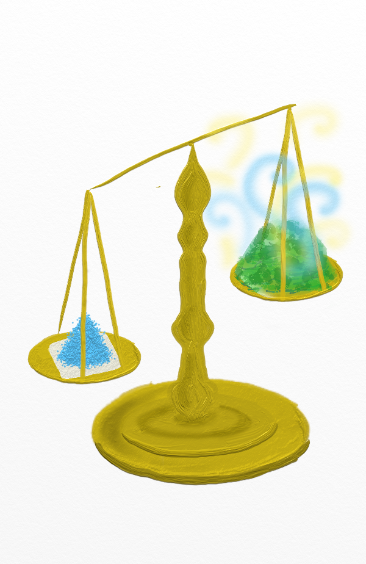
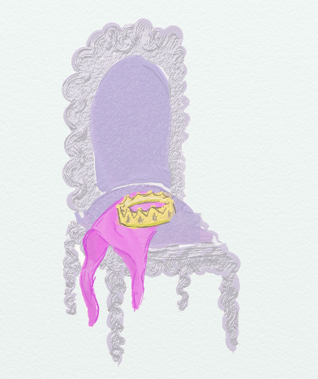

# Etablir le lien entre deux variables: tests d'hypothèse {#testshyp}

```{r,echo=FALSE, message=FALSE, warning=FALSE}
library(tidyverse)
library(gridExtra)
library(purrr)
library(magrittr)
library(gganimate)
library(infer)
source("scripts/utils.R")
knitr::opts_chunk$set(echo = TRUE, message=FALSE, warning=FALSE)

chateauxEtBoulots=read.table("datasets/chateauxEtBoulots.csv",header=TRUE,sep=";")
broceliande=read.csv("datasets/broceliande.csv",sep=";", header=T)
potions=read.csv("datasets/potions.csv",sep=";", header=T)
```


Avant de me lancer sur les modèles statistiques, je vais tenter d'expliquer le principe des **tests d'hypothèse**. 

L'objectif des tests d'hypothèse est de déterminer si un **effet observé à l'échelle de l'échantillon** résulte d'un **effet réel à l'échelle de la population**, autrement dit, il s'agit de déterminer si l'effet observé est **significatif** et non pas simplement lié à l'**aléa d'échantillonnage**. 

## Tests d'hypothèse paramétriques: exemple du t-test {#ttest}

Bien qu'il existe une multitude de tests d'hypothèses (test de Student, test du Chi-2, test de Mann-Whitney, etc. en fonction du type de données et de la problématique considérés), la logique et les "mécanismes d'interprétation" sont toujours les mêmes...

Je vais donc décrire en détail les idées sous-jacente à un test statistique, en développant l'exemple d'un test particulier, le **t-test**. 

Le **t-test** (ou **test de Student**) est conçu pour tester des **différences de moyennes entre deux groupes**.


<table>
  <col width="150">
  <col width="300">
<tr><td>
</img>
</td>
<td>
Par exemple, on cherche à savoir si la quantité de poudre de perlimpinpin dans un arbre est liée à la présence d'un enchantement (comme la figure vue en section \@ref(boxplot) le suggérait).
</td>
</tr>
</table>

```{r boxplot_ench_perl_2, fig.width=5, fig.height=3}
ggplot(broceliande, aes(x=enchantement, y=perlimpinpin))+
  geom_boxplot(fill="lightblue")
```

### Le t-test en théorie

Je "conceptualise" mon problème par le modèle suivant: 

<div class="encadre">
$perlimpinpin$ a une distribution $\mathcal{N}(\mu_e,\sigma_e)$ pour les 
arbres enchantés, et $\mathcal{N}(\mu_f,\sigma_f)$ pour les autres.
</div>

Je définis mon hypothèse:

<div class="encadre">
$H_0:\{\mu_e=\mu_f\}$ 
</div>

Selon cette hypothèse, il n'y a **pas de différence réelle** de moyenne entre les deux groupes (même si, de facto, il y a une différence *observée*).

Autrement dit, l'hypothèse que je cherche à tester statistiquement est celle selon laquelle "la quantité de perlimpinpin moyenne n'est pas différente selon les groupes" ... alors que mon hypothèse au sens "scientifique" était plutôt l'hypothèse inverse puisque j'ai en réalité l'intention de prouver que l'enchantement **a un effet significatif sur la quantité de perlimpinpin**!... Il faut donc faire attention à ne pas se mélanger les pinceaux... 

Considérons la statistique suivante:

<div class="encadre">

$$
T=\frac{\bar X_e-\bar X_f}{\sqrt{\frac{s_e^2}{n_e}+\frac{s_f^2}{n_f}}}=\frac{\bar X_e-\bar X_f}{\sqrt{eqm_e+eqm_f}}
$$
</div>

où

- $\bar{X_e}$ et $\bar{X_f}$ sont les estimateurs de la moyenne (par groupe)
- $s_e$ et $s_f$ sont les estimateurs des écarts-types (par groupe)
- $n_e$ et $n_f$ sont les effectifs observés (par groupe)

Cette métrique est donc d'autant plus grande (en valeur absolue) que 

- l'écart entre moyennes est important,
- les tailles d'échantillons sont importantes,
- la variance au sein de chaque groupe est petite.

<div class="encadre">
Si notre hypothèse $H_0$ était vraie alors cette statistique $T$ devrait suivre une **distribution de Student** avec $\nu$ degrés de liberté.
</div>

(Il s'agit d'un résultat **mathématique**, que je ne démontrerai pas ici!)

Le **paramètre $\nu$** correspond à:

$$
\nu=\frac{\left(\frac{s_e^2}{n_e}+\frac{s_f^2}{n_f}\right)^2}{{(\frac{s_e^2}{n_e})}^2\frac{1}{n_e-1}+{(\frac{s_f^2}{n_f})}^2 \frac{1}{n_f-1}}=\frac{(eqm_e+eqm_f)^2}{eqm_e^2\ \frac{1}{n_e-1}+eqm_f^2\ \frac{1}{n_f-1}}
$$


On peut calculer les valeurs $t_{obs}$ (valeur de $T$ pour les observations) et $\nu$ "à la main":

```{r broc_ttest_calc_alamain, echo=TRUE}
broc_test=broceliande %>%
  group_by(enchantement) %>% 
  summarise(m=mean(perlimpinpin),
            s2=sd(perlimpinpin)^2,
            n=n()) %>% 
  mutate(eqm=s2/n,
         w=1/(n-1)) %>% 
  mutate(eqmw=w*eqm^2)
valeurs_obs=broc_test %>%
  summarise(t_obs=diff(m)/sqrt(sum(eqm)),
            nu=sum(eqm)^2/sum(eqmw))
valeurs_obs
```

Voici donc la distribution de Student à $\nu$=`r round(valeurs_obs$nu)` degrés de liberté (i.e. la distribution que $T$ doit suivre, théoriquement, si l'hypothèse $H_0$ est vraie): 

```{r broc_ttest_calc_infer, echo=FALSE, fig.width=5, fig.height=2.5}
broceliande %>%
  specify(perlimpinpin ~ enchantement) %>%
  hypothesize(null = "independence") %>% 
  calculate(stat = "t") %>% 
  visualize(method = "theoretical")
```

Par rapport à cette **distribution théorique de $T$ "sous hypothèse $H_0$"**, voilà comment se situe la **valeur observée de T pour notre échantillon ($t_{obs}$)**:

```{r broc_ttest_calc_infer_et_obs, echo=FALSE, fig.width=5, fig.height=2.5}
mytest <- broceliande %>% 
  t_test(formula = perlimpinpin ~ enchantement, order=c(TRUE,FALSE))
t_obs=mytest%>% 
  select(statistic) %>% 
  pull()
broceliande %>%
  specify(perlimpinpin ~ enchantement) %>%
  hypothesize(null = "independence") %>% 
  calculate(stat = "t") %>% 
  visualize(method = "theoretical",
            obs_stat=t_obs,
            direction = "two_sided")
```

Comme on peut le voir sur ce graphique, la valeur que l'on observe pour T est plutôt "excentrée" par rapport à la distribution théorique sous hypothèse $H_0$. 

En effet, la **probabilité d'observer une valeur au moins aussi excentrée (à droite ou à gauche) sous hypothèse $H_0$**, ou **p-value** est de:

```{r calc_ttest_pval_alamain}
2*(1-pt(valeurs_obs$t_obs,valeurs_obs$nu))
```

C'est cette valeur de probabilité qui est représentée par la surface coloriée en rouge dans le graphique ci-dessus.

Si la p-value est particulièrement petite, cela tend à prouver que **la valeur observée de $T$ est peu probable sous hypothèse $H_0$**. Cela amène donc à remettre en question l'hypothèse (et non l'observation!!).

En dessous d'un certain seuil pour cette probabilité (par exemple, $\alpha=5$\%), on décide de rejeter l'hypothèse $H_0$. Dans ce cas on peut affirmer qu'il existe bien un effet significatif de `enchantement` sur `perlimpinpin`.

La valeur $\alpha$ est souvent, par convention, 5\% (il arrive aussi que l'on voie 10\%, 1\%, etc.). Cette valeur **n'est pas un repère absolu** (si vous êtes à 5.1\% plutôt qu'à 4.9\% ça ne devrait pas *fondamentalement* changer votre conclusion...).

### Erreurs associées à un test d'hypothèse

Cette valeur seuil $\alpha$ abordée précédemment correspond en fait à un risque d'erreur de type I que l'on est "prêt à accepter".

<div class="encadre">
Faire une **erreur de type I**, ça consiste à **rejeter l'hypothèse nulle alors qu'elle est vraie** (c'est-à-dire, affirmer qu'une différence est significative alors que ce n'est pas le cas). Le **risque d'erreur de type I** est souvent noté $\alpha$

Faire une **erreur de type II**, au contraire, ça consiste à **ne pas rejeter l'hypothèse nulle alors qu'elle est fausse** (c'est-à-dire, ne pas conclure que la différence est significative alors qu'elle existe vraiment). Le **risque d'erreur de type II** est souvent noté $\beta$.


Cas            |  $H_0$ rejetée              | $H_0$ acceptée
---------------|-----------------------------|---------------
$H_0$ vraie    | erreur de type I ($\alpha$) | CORRECT
$H_0$ fausse   |  CORRECT                    | erreur de type II ($\beta$)

La **puissance d'un test** est égale à 1-$\beta$ i.e. elle correspond à la probabilité de détecter un effet quand il existe ($H_0$ est fausse et onR rejette $H_0$).

</div>

Quand on choisit de réaliser un test avec un risque $\alpha$ particulièrement bas, alors le risque $\beta$ est particulièrement élevé: alors on le fait au détriment de la **puissance** du test (c'est-à-dire que plus on minimise le risque de dire qu'il y a un effet alors qu'il n'y en a pas, plus on maximise le risque de "passer à côté" d'un effet qui existe).

### Le t-test en pratique

En pratique, pour réaliser un t-test sous R, on n'a pas besoin de faire à la main toutes les étapes du calcul détaillé dans le paragraphe précédent (ouf!). Il existe *évidemment* des fonctions dans R pour faciliter la tâche.

La fonction de base est `t.test()`:

```{r myttest,type="essentiel", echo=TRUE}
mytest=t.test(perlimpinpin~enchantement, data=broceliande)
print(mytest)
```

Plusieurs informations s'affichent:

- le **nom du test** (t-test de Welch pour deux échantillons)
- certains **éléments** qui interviennent dans le calcul d'une **p-value** (valeur de métrique observée t, nombre de degrés de liberté df) 
- la **p-value** elle-même
- l'hypothèse alternative (et non pas $H_0$) selon laquelle la différence de moyenne entre les groupes **n'est pas** égale à 0
- un **intervalle de confiance à 95\% pour cette différence de moyenne**
- les **moyennes estimées** pour chaque groupe

On retrouve notamment la valeur $t_{obs}$, $\nu$ (nombre de degrés de liberté) et la p-value calculés "à la main" dans le paragraphe précédent:

```{r myttest_detail}
mytest$p.value
mytest$statistic
mytest$t_df
```

Outre la fonction t.test de "base", il est également possible d'utiliser le package "infer" pour réaliser un t-test "à la tidyverse":

```{r myttest_infer, fig.width=5, fig.height=2.5}
mytest <- broceliande %>% 
  t_test(formula = perlimpinpin ~ enchantement, order=c(TRUE,FALSE))
print(mytest)

t_obs=mytest%>% 
  select(statistic) %>% 
  pull()
print(t_obs)

broceliande %>%
  specify(perlimpinpin ~ enchantement) %>%
  hypothesize(null = "independence") %>% 
  calculate(stat = "t") %>% 
  visualize(method = "theoretical",
            obs_stat=t_obs,
            direction = "two_sided")

```

<div class="exo">

Considérez le jeu de données `broceliande`. Nous allons nous intéresser à deux sous-populations distinctes: 

- les chênes d'une part, 
- les sapins d'autre part.

Pour l'une et l'autre de ces populations, l'enchantement a-t-il une influence sur la quantité de perlimpinpin?

```{r, echo=FALSE, results=FALSE}
t.test(perlimpinpin~enchantement, data=filter(broceliande,espece=="chene"))
t.test(perlimpinpin~enchantement, data=filter(broceliande,espece=="sapin"))
```


</div>


### Les conditions d'utilisation du t-test

Revenons à la manière dont j'ai spécifié mon modèle:

<div class="encadre">
$perlimpinpin$ a une distribution $\mathcal{N}(\mu_e,\sigma_e)$ pour les 
arbres enchantés, et $\mathcal{N}(\mu_f,\sigma_f)$ pour les autres.
</div>

On a vu dans la section \@ref(ttest) qu'on connaissait la distribution de la statistique $T$ sous hypothèse $H_0$, mais aussi sous réserve que la distribution de $perlimpinpin$ dans chaque groupe défini par $enchantement$ soit **normale**.

Que se passe-t-il si ce n'est pas le cas?

... et en l'occurrence, **ce n'est pas le cas**. Voyez plutôt, si l'on réaliste un test de Shapiro-Wilk pour tester la normalité des données (pour chaque groupe), ce test rejette l'hypothèse de distribution normale de perlimpinpin pour les arbres non-enchantés:

```{r shapiro}
# arbres enchantés
shapiro.test(filter(broceliande,enchantement)$perlimpinpin)
# arbres non-enchantés
shapiro.test(filter(broceliande,!enchantement)$perlimpinpin)
```


En fait, comme dans le cas du **Théorème Central Limite** (voir section \@ref(TCL)), quand bien même l'hypothèse de normalité des résidus ne serait pas respectée, la distribution de $T$ tend bien vers une distribution de Student à $\nu$ degrés de liberté **pour des tailles d'échantillon "suffisamment grandes"**.

Tout le sel de la situation consiste à estimer la valeur pour laquelle on estime que la taille d'échantillon est "suffisamment grande" (ce seuil étant d'autant plus élevé que la distribution des résidus est éloignée de la distribution normale) pour pouvoir appliquer le t-test quand bien-même l'hypothèse de normalité ne serait pas respecté...

Le package `infer` permet  de travailler assez facilement **non pas sur une distribution théorique de la statistique $T$** (reposant, donc, sur un modèle de distribution supposé) mais sur la **distribution observée de $T$ quand on réalise des permutations**.

Le principe des permutations réalisées ici est de réaliser de nombreuses fois l'opération suivante:

- étiqueter au hasard les individus selon les **modalités de la variable définissant les groupes** (et selon les effectifs observés)
- calculer la **statistique $T$** pour ce jeu de données (généré, donc, sous hypothèse que la variable qui définit le groupe et la réponse quantitative soient indépendants)

On obtient ainsi la **distribution de la statistique $T$ sous hypothèse d'indépendance** pour les distributions observées.

```{r infer_permutations_ttest, fig.width=5, fig.height=2.5}
permutations=broceliande %>% 
  specify(perlimpinpin ~ enchantement) %>% 
  hypothesize(null="independence") %>% 
  generate(reps=1000,type="permute") %>% 
  calculate(stat="t", order=c(FALSE,TRUE)) %>% 
  visualize(method="simulation",
            obs_stat=t_obs,
            direction="two_sided")

```

Ici on constate que la significativité du résultat ne fait pas de doute!


### Principe général d'un test d'hypothèse *paramétrique*

<div class="encadre">
- On considère un **modèle statistique** décrivant nos données
- On considère une certaine **hypothèse** $H_0$ concernant les paramètres du modèle
- On considère une **métrique $S$** (il s'agit d'une *variable aléatoire*), dont la nature dépend du test réalisé.
-  On calcule sa **distribution théorique** en se basant sur le modèle assorti de l'hypothèse $H_0$. 
- On calcule la **valeur prise par $S$ pour les observations**: on obtient ainsi la mesure **$S_{obs}$**. $S_{obs}$ est une *réalisation* de la variable $S$.
- On regarde **où se place $S_{obs}$ par rapport à distribution théorique de $S$**: on calcule la probabilité que $S$ soit au moins aussi "extrême" que $S_{obs}$. C'est cette probabilité qui constitue la **p-value**.
</div>

Dans tous les cas, lorsque l'on réalise un test statistique, il faut être très attentif aux éléments suivants:

- Les hypothèses du modèle sous-jacent au test (par exemple, pour le t-test, la variable d'intérêt doit être de distribution gaussienne. En revanche, le fait que vous utilisiez le t-test de Welch et non de Student vous permet de supposer que la variance est différente dans les deux groupes)
- La nature de l'hypothèse $H_0$ (Si vous vous trompez sur la nature de cette hypothèse, alors vous vous tromperez dans la manière dont vous interprétez les résultats du test!)


## Tests non-paramétriques: exemple du test U de Mann-Whitney

### A quoi sert-il?

Le **test U de Mann-Whitney** (aussi appelé **test de la somme des rangs de Wilcoxon** ou plus simplement **test de Wilcoxon**) sert à tester l'hypothèse selon laquelle **la distribution des données est la même pour deux groupes**.

La **p-value** associée à ce test va ainsi répondre à la question suivante: 

Si les données pour les deux groupes étaient issues d'une **même population**, quelle serait la **probabilité que l'on observe par hasard une différence de rangs(ou localisations) entre les deux groupes aussi forte que celle observée sur les données**?

Le test U de Mann-Whitney est souvent utilisé comme solution alternative à l'utilisation d'un **t-test** dans le cas où les données ne sont pas distribuées selon une loi normale et/ou dans le cas où les données sont peu nombreuses. 

Il s'agit en effet d'un **test non-paramétrique**, qui ne repose ni sur une hypothèse de distribution gaussienne des données par groupe, ni sur une propriété asymptotique.

### Un exemple

Considérons une sous-partie du jeu de données `brocéliande`: ici, on va s'intéresser uniquement aux chênes enchantés, et étudier le lien entre `feerie`(groupe A: pas de fée, groupe B: au moins une fée) et `âge`:

```{r chenes_enchantes_feerie_age, fig.width=5,fig.height=3}  
chenes_enchantes=broceliande %>%
  filter(espece=="chene",enchantement) %>%
  mutate(feerie=factor(fees>=1, labels=c("A","B"))) %>% 
  select(feerie,age)

ggplot(chenes_enchantes, aes(x=feerie, y=age))+
  geom_boxplot(fill=c("grey","aquamarine"))
```


On a ici des données qui ne sont ni franchement nombreuses, ni franchement normales. 
  
#### Sur quelle métrique le test de Mann-Whitney se base-t-il?

Le test U de Mann-Whitney calcule une p-value qui se base non pas sur les données brutes, mais sur leurs **rangs**. Les rangs en question correspondent à l'**emplacement de chaque donnée au sein de la série** lorque cette série est **ordonnée** par ordre croissant. 

```{r chenes_enchantes_rangs}
chenes_enchantes=chenes_enchantes %>% 
  mutate(rang_age=min_rank(age))
head(chenes_enchantes)
```

Les **distributions des rangs** sont beaucoup moins affectées par l'existence de valeurs extrêmes que ne le sont les distributions des valeurs brutes: 

```{r chenes_enchantes_boxplot_rangs, fig.width=5,fig.height=3}  
ggplot(chenes_enchantes, aes(x=feerie, y=rang_age))+
  geom_boxplot(fill=c("grey","aquamarine"))
```  

Représentons les rangs des individus ainsi que l'appartenance de ces individus aux deux groupes. Les pointillés représentent la moyenne des rangs pour chacun des groupes

```{r chenes_enchantes_rangs_ensemble,echo=FALSE, fig.width=2,fig.height=3}
chenes_enchantes_resume=chenes_enchantes %>%
  group_by(feerie) %>% 
  summarise(moy_rang_age=mean(rang_age))

ggplot(chenes_enchantes, aes(x=1,y=rang_age, color=feerie))+
  geom_point()+
  scale_color_manual(values=c("A"="grey","B"="aquamarine"))+
  geom_hline(yintercept=chenes_enchantes_resume$moy_rang_age,
             col=c("grey","aquamarine"),
             size=3, alpha=0.5)
```

Le test de Mann-Whitney peut se baser sur une métrique $W$ (en lien avec la dénomination "test de Wilcoxon") qui correspond à 

$$
W=W_A=\sum_{i=1}^{n}\mathbf{1}_A R_i-n_A(n_A+1)/2\\
$$

On peut aussi définir $W_B$ :

$$
W_B=\sum_{i=1}^{n}\mathbf{1}_B R_i-n_B(n_B+1)/2
$$

Les nombres $n_A(n_A+1)/2$ et $n_B(n_B+1)/2$ correspondent en fait à ce que serait la somme des rangs si tous les individus du groupe A (respectivement B) avaient les rangs 1,2,3,....,$n_A$ (respectivement 1,2,3,...,$n_B$).

$W$ est ainsi d'autant plus grand que les individus du groupe A présente des rangs élevés au sein de l'ensemble des individus.

Alternativement, on pourrait considérer la métrique $U$ (en lien avec la dénomination "test U de Mann-Whitney") qui correspond à:

$$
U=min(W_A,W_B)
$$

Cette métrique est quant à elle d'autant plus faible que l'un ou l'autre des groupes présente des rangs bas.

Calculons la métrique $W$ pour nos données:

```{r wilcox_calc_stat_alamain}
dfsummary=chenes_enchantes %>% 
  group_by(feerie) %>% 
  summarize(n=n(),
            SR=sum(rang_age)) %>% 
  mutate(m=n*(n+1)/2) %>% 
  mutate(W=SR-m)
dfsummary
```   


En l'occurence, par construction on a toujours
        
$$W_A+W_B=n_An_B$$
 

### A quoi la p-value correspond-elle?

Supposons que **le groupe A ne corresponde pas à des rangs particulièrement élevés dans la série**. Dans ce cas, les rangs observés pour A sont comme "attribués au hasard". Quelle est alors la distribution de $W$? 

Pour répondre à cette question nous allons **simuler 1000 jeux de données issus d'une réattribution au hasard des rangs dans le jeu de données initial**

Nous calculerons pour chaque simulation la valeur de $W$. 

```{r wilcox_sim, fig.width=5,fig.height=3} 
Wsim=function(i){
  W_sim=chenes_enchantes %>%
    mutate(rangsim=sample(1:nrow(chenes_enchantes),replace=FALSE)) %>% 
    group_by(feerie) %>% 
    summarize(n=n(),
              SR=sum(rangsim)) %>% 
    mutate(m=n*(n+1)/2) %>% 
    mutate(W=SR-m) %>% 
    select(W) %>% 
    t() %>% 
    as.data.frame() %>% 
    rename(W_A=V1,W_B=V2)
    return(W_sim)
}

dfsim=map(1:1000, Wsim) %>% bind_rows()
             
ggplot(dfsim, aes(x=W_A))+
  geom_histogram(fill="lightpink")+
  geom_vline(xintercept=dfsummary$W[1])+
  ggtitle("distrib. de W sous hypothèse nulle")
```

La distribution empirique de W nous permet de calculer la p-value correspondant au test de l'hypothèse "le groupe A n'a pas une localisation particulièrement élevée".

```{r wilcox_calc_alamain_unilateral}
montest=wilcox.test(age~feerie,
                    alternative="greater",
                    data=chenes_enchantes)

print(montest)
print(length(which(dfsim$W_A>=montest$statistic))/1000)

```

Ici on veut en fait faire un test **bilatéral** : notre hypothèse nulle "la distribution des données est la même pour les deux groupes" correspond en fait à deux sous-hypothèses:

- "le groupe A n'a pas une localisation particulièrement élevée" ET
- "le groupe A n'a pas une localisation particulièrement basse" (i.e. "le groupe B n'a pas une localisation particulièrement élevée")

On s'interroge ainsi non seulement sur la distribution de $W_A$ mais aussi sur la distribution de $W_B$.

Or ces deux distributions sont en fait les mêmes... 

On peut ainsi retrouver la p-value fournie par le test:

```{r wilcox_calc_pval_alamain}
montest=wilcox.test(age~feerie,
                    alternative="two.sided",
                    data=chenes_enchantes)
print(length(which(dfsim$W_A>=montest$statistic))/1000)
print(length(which(dfsim$W_B<=montest$statistic))/1000)
```


### Comment faire un test U de Mann-Whitney sous R?

```{r wilcox_faire_sous_R}  
montest=wilcox.test(age~feerie, data=chenes_enchantes)
montest
```                                                                                                                                                                                                    

Ici, la p-value est plus grande que 0.05: on ne parvient pas à rejeter l'hypothèse selon laquelle les données des deux groupes proviennent d'une même distribution au seuil $\alpha=0.05$.

### Comment R calcule-t-il la p-value?

Ci-dessus, j'ai montré comment on peut recalculer "à la main" la p-value fournie par le test. En fait, pour des valeurs de $n_A$ et $n_B$ assez élevées, la distribution de W est approximativement normale (R n'a pas besoin d'effectuer des simulations, comme nous l'avons fait, pour calculer la p-value).

Pour des valeurs de $n_A$ et $n_B$ relativement faibles, les p-values sont **tabulées** (c'est-à-dire que pour des valeurs $n_A$ et $n_B$ faibles, R a en mémoire les quantiles de la distribution de W). Cependant, de la même manière que dans nos simulations ci-dessus, ces p-values ont été calculées en supposant qu'il n'y avait **pas d'ex-aequos** (i.e. pour calculer ces quantiles, il a été supposé que les rangs étaient 1,2,3,....,n, et non, par exemple, 2,2,2,3,4,5,...,n). C'est la raison pour laquelle R affiche des Warnings dans le cas où 

- les données sont peu nombreuses ET
- il y a des ex-aequos.

```{r}
# xA=c(1.5,6.3,6.3,2.7)
# xB=c(2.5,3.3,1.3,2.1,5.7,1.1) 
# nA=length(xA)
# nB=length(xB)
# n=nA+nB
# groupes=c(rep("A",nA),rep("B",nB))
# x=c(xA,xB)
# 
# wilcox.test(x~groupes)
```

Pour des échantillons plus grands, on n'a pas ce même message d'erreur car la p-value est calculée en se basant sur l'approximation normale:

```{r wilcox_approx_normale}
xA=rlnorm(50,3,2)
xB=rlnorm(50,4,2)
xA[1:10]=xA[11:20]
nA=length(xA)
nB=length(xB)
n=nA+nB
groupes=c(rep("A",nA),rep("B",nB))
x=c(xA,xB)

wilcox.test(x~groupes)
```
### Comparaison

```{r chenes_enchantes_ttest_compar}
t.test(age~feerie, data=chenes_enchantes)
wilcox.test(age~feerie, data=chenes_enchantes)
```

                                      
## Etablir le lien entre deux variables catégorielles

Intéressons-nous au jeu de données `chateauxEtBoulots`, et au lien entre `sexe` et `activite` que nous avons déjà décrit dans la section \@ref(desconti).

### Tableau de contingence

Nous avons-vu que la comparaison entre le tableau des effectifs croisés **observés** et des effectifs **attendus** sous hypothèse d'indépendance pouvait nous renseigner sur un lien éventuel entre les deux variables considérées. 

En l'occurrence, on peut noter les **effectifs observés** dans chacune des J cases du tableau $\bar {N_i}$ et les **effectifs attendus** $N_i$.

A partir de ces deux tableaux, une **statistique du Chi-2** (écrite $\chi^2$) peut être calculée et utilisée pour tester l'hypothèse d'indépendance entre les deux variables catégorielles. La statistique du $\chi^2$ correspond à :

$$\chi^2=\sum_{i=1}^{J}\frac{(\bar{N_i}-N_i)^2}{N_i}$$
**Sous hypothèse d'indépendance**, et sous réserve que les effectifs par case soient suffisamment importants, cette statistique $\chi^2$ est censée suivre une **distribution du $\chi^2$ à $J-2$ degrés de liberté**.

C'est ce résultat (mathématique) qui permet de fournir une **p-value** qui correspond à la **probabilité d'obtenir une valeur de $\chi^2$ supérieure à celle qui est calculée sur les observations**.

### Faire un test du Chi-2 sous R

<table>
  <col width="150">
  <col width="300">
  <tr>
  <td>
  <td>Examinons par exemple le jeu de données `chateauxEtBoulots` et plus particulièrement le lien entre le sexe et l'activité de nos personnages de contes de fée... On a vu en section \@ref(tableaucontingences) comment **décrire le lien** entre ces deux variables catégorielles par un **tableau de contingences**. Voyons maintenant comment l'on peut **tester la significativité de ce lien**.</td>
  </tr>
</table>

```{r chateauxEtBoulots_chisq_en_pratique}
montest=chisq.test(table(chateauxEtBoulots$sexe,chateauxEtBoulots$activite))
print(montest)
```

Ici la p-value est très petite, montrant (comme on s'y attendait) que les deux variables **ne sont pas indépendantes**.

On peut examiner plus avant les éléments renvoyés par ce test de la manière suivante:

```{r chisqtest_elems}
names(montest)
```

On retrouve ainsi, entre autres choses, des éléments d'information concernant

- les **effectifs observés**


```{r chisqtest_observed}
montest$observed
```

- les **effectifs attendus sous hypothèse d'indépendance**

```{r chisqtest_expected}
montest$expected
```


<div class="exo">

Considérez le tableau `chateauxEtBoulots` et les variables `tenue` et `region`. Les tendances en terme de couleurs de tenue sont-elles bien significativement différentes en fonction de la région de Fantaisie?...

```{r, echo=FALSE, results=FALSE}
chisq.test(table(chateauxEtBoulots$tenue,chateauxEtBoulots$region))
```

</div>

### Petits effectifs

Un test du $\chi^2$ est construit en supposant que **les effectifs $\bar N_j$ sont "suffisants")**. Ainsi, quand certaines cases du tableau de contingence comprennent trop peu d'individus, appliquer un test du $\chi^2$ peut causer un "warning" stipulant que *l'approximation du $\chi^2$ peut être incorrecte*.

Conidérons par exemple un sous-jeu de données de `chateauxEtBoulots` rassemblant uniquement les individus de noble extraction, et intéressons-nous au lien entre leur sexe et leur couleur de tenue:

```{r chateauxEtBoulots_princiere}
tenue_princiere=filter(chateauxEtBoulots, activite=="royaute") %>% 
  mutate(tenue=as.factor(as.vector(tenue)))

table_tenue_princiere=table(tenue_princiere$sexe, tenue_princiere$tenue)
table_tenue_princiere


chisq.test(table_tenue_princiere)
```

Ici, on a bien des effectifs réduits qui causent le renvoi d'un warning...

Le package `infer` permet, dans ce genre de situation, de **calculer une p-value en passant par des permutations** plutôt qu'en utilisant la distribution de la statistique du $\chi^2$ qui s'applique pour des effectifs observés importants.

Le principe des permutations réalisées ici est de réaliser de nombreuses fois l'opération suivante:

- étiqueter au hasard les individus selon les **modalités du premier facteur** (et selon les effectifs observés pour celui-ci)
- étiqueter au hasard les individus selon les **modalités du second facteur** (et selon les effectifs observés pour celui-ci)
- calculer la **statistique du $chi^2$** pour ce jeu de données (généré, donc, sous hypothèse que les deux facteurs soient indépendants)

On obtient ainsi la **distribution de la statistique $chi^2$ sous hypothèse d'indépendance** pour les effectifs observés de l'un et l'autre facteur (aussi déséquilibrés et faibles soient-ils).

La valeur observée du $\chi^2$ sur les données est la suivante:

```{r infer_obs_chisq, warning=FALSE, message=FALSE}
obs_chisq=tenue_princiere %>% 
  chisq_test(formula=tenue~sexe) %>% 
  select(statistic) %>% 
  pull()

obs_chisq # pareil que chisq.test(tenue_princiere)$statistic, mais obtenu via infer

```

On simule 1000 jeux de données différents à partir du jeu de données `sim_princiere` selon la méthode expliquée ci-dessus. On obtient ainsi 1000 valeurs de la statistique $\chi^2$:

```{r infer_generate_chisq}
sim_princiere=tenue_princiere %>%
  specify(tenue~sexe) %>% 
  hypothesize(null="independence") %>%
  generate(reps=1000, type="permute") %>% 
  calculate(stat="Chisq") 

head(sim_princiere)
```

Cela permet de décrire la distribution de la statistique $\chi^2$ et d'en déduire une p-value:

```{r sim_princiere_visu, fig.width=5, fig.height=2.5}
resume_sim_princiere=
  sim_princiere %>%
  mutate(case=stat<obs_chisq) %>% 
  group_by(case) %>% 
  summarise(prop=n()) %>% 
  mutate(prop=prop/1000)
resume_sim_princiere

sim_princiere%>% 
  visualize(obs_stat=obs_chisq, direction="greater")
```

On obtient ainsi la distribution réelle de la statistique du $\chi^2$ sous hypothèse d'indépendance, et la valeur de la p-value (`r resume_sim_princiere$prop[1]`). Ici, on remarque que la p-value est quasiment inchangée selon la méthode de calcul (distribution théorique ou par permutations)! On n'est pas en mesure d'affirmer que la couleur de tenue des princes et princesses dépend de leur sexe.


<div class="exo">

On reprend l'exercice précédent...

Considérez le tableau `chateauxEtBoulots` et les variables `tenue` et `region`. Les tendances en terme de couleurs de tenue sont-elles bien significativement différentes en fonction de la région de Fantaisie?...

Répondez à cette question à l'aide du package `infer` et des permutations, de sorte de ne pas être gêné par le faible effectif dans certaines cases du tableau de contingence...

```{r, echo=FALSE, results=FALSE}
obs_chisq=tenue_princiere %>% 
  chisq_test(formula=tenue~region) %>% 
  select(statistic) %>% 
  pull()

obs_chisq # pareil que chisq.test(tenue_princiere)$statistic, mais obtenu via infer
sim_princiere=tenue_princiere %>%
  specify(tenue~sexe) %>% 
  hypothesize(null="independence") %>%
  generate(reps=1000, type="permute") %>% 
  calculate(stat="Chisq") 

head(sim_princiere)
resume_sim_princiere=
  sim_princiere %>%
  mutate(case=stat<obs_chisq) %>% 
  group_by(case) %>% 
  summarise(prop=n()) %>% 
  mutate(prop=prop/1000)
resume_sim_princiere

sim_princiere%>% 
  visualize(obs_stat=obs_chisq, direction="greater")
```

</div>
