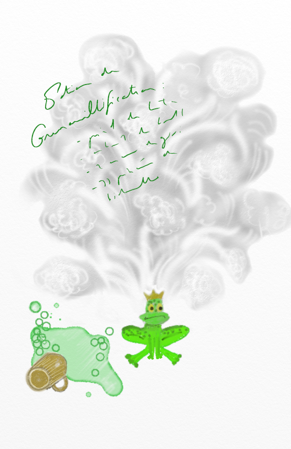

# Modéliser le lien entre plusieurs variables explicatives et une variable réponse

```{r,echo=FALSE, message=FALSE, warning=FALSE}
library(tidyverse)
library(gridExtra)
library(purrr)
library(magrittr)
library(gganimate)
library(infer)
library(purrr)
library(xtable)
source("scripts/utils.R")
knitr::opts_chunk$set(echo = TRUE, message=FALSE, warning=FALSE)

chateauxEtBoulots=read.table("datasets/chateauxEtBoulots.csv",header=TRUE,sep=";")
broceliande=read.csv("datasets/broceliande.csv",sep=";", header=T)
potions=read.csv("datasets/potions.csv",sep=";", header=T)
```


Si les modèles multifactoriels reposent en grande partie sur des principes similaires à ceux des modèles "simples", ils sont légèrement plus difficiles à appréhender car il est **difficile de produire des représentations graphiques de ces modèles**. En effet, s'il est simple de représenter $Y$ en fonction de $X$, il devient délicat de représenter $Y$ en fonction de $X_1$ et $X_2$ (et, a fortiori, en fonction de $X_1$,$X_2$,$X_3$, etc.).

Néanmoins, moyennant quelques efforts, et en utilisant astucieusement les possibilités graphiques de R, il est possible de visualiser un certain nombre d'éléments en lien avec ces modèles. Nous allons voir des exemples de tels graphiques dans les paragraphes suivants.

Une autre difficulté inhérente aux modèles multifactoriels est liée aux **possibles interactions entre variables explicatives**. 

## Plusieurs variables quantitatives comme variables explicatives: régression multiple


<table>
<col width="250">
<col width="200">
<tr>
<td></td>
<td>
Intéressons-nous au jeu de données `potions`. On aimerait connaître quels ingrédients entrent dans la composition des potions ayant une propriété d'altération. 


Comme on dispose de scores d'alteration `p_alteration` (c'est-à-dire que la **variable réponse est quantitative**) et des quantités d'ingrédients `i_givreboises`, `i_bave_crapaud`, `i larmes_crocodile`, etc. (c'est-à-dire que les **variables explicatives sont quantitatives** également), on entre dans le cadre d'une **régression linéaire multiple**: 
</td>
</tr>
</table>

Je commence par arranger le jeu de données `potions` pour ne garder que les ingrédients (je log-transforme les quantités d'ingrédients car leur distribution est particulièrement asymétrique) et la propriété `p_alteration`. J'obtiens le jeu de données `ingredients_alteration`

```{r alteration_i, echo=TRUE}
potions_i=potions %>%
  select(starts_with("i")) %>% 
  mutate_all("log")

ingredients_alteration=bind_cols(select(potions,p_alteration),
                                 potions_i)
head(ingredients_alteration)
```

### Représentation graphique 

#### Représentation des nuages de points variable explicative vs réponse {#nuagespotions}

```{r nuage_deux_a_deux_potions}
ingr_alt_var_as_mod=ingredients_alteration %>% 
  gather("ingredient","x",starts_with("i_"))

ggplot(ingr_alt_var_as_mod, aes(x=x, y=p_alteration, col=ingredient))+
  geom_point()+
  geom_smooth(method="lm")+
  facet_wrap(~ingredient,scales="free")+
  theme(legend.position="none")

```


#### Représentation des corrélations

```{r corrplot_ingredients_alteration}
library(corrplot)
res=cor(ingredients_alteration)
corrplot(res,
         type = "upper", 
         diag=FALSE,
         tl.col = "dark grey", tl.srt = 45)
```

### Réalisation de la régression multiple

Pour réaliser une régression multiple sur R, on utilise (encore une fois) la fonction `lm()`

On adapte simplement la formule pour prendre en compte plusieurs variables explicatives de la manière suivante:

```{r regmult_fewvar}
myregmult=lm(p_alteration~i_bave_crapaud+i_pierre_lune+i_givreboises,
             data=ingredients_alteration)
```

Si l'on veut considérer un grand nombre de variables explicatives, il peut être plus aisé de passer par la syntaxe suivante (avec laquelle l'ensemble des variables de `ingredients_alteration` -à l'exception de la variable réponse bien sûr-, est utilisé):

```{r regmult_allvar}
myregmult=lm(p_alteration~.,data=ingredients_alteration)
summary(myregmult)
```

D'après ce modèle, la présence d'ailes de papillon et de larmes de crocodile a un effet significatif sur la propriété d'altération de la potion.

Pourtant, à la vue du graphique \@ref(nuagespotions), on pouvait s'attendre à avoir d'autre ingrédients avec un effet significatif sur cette propriété alchimique... Et, de fait, si l'on fait des modèles de **régression linéaire simple** pour chaque ingrédient, alors il semble qu'en réalité d'autres ingrédients que ces deux là aient un effet significatif.

```{r regressions_simples_potions_alteration}
nested_ingr=ingr_alt_var_as_mod %>% 
  group_by(ingredient) %>% 
  nest()

pval=nested_ingr %>% 
  pull(data) %>% 
  map(~summary(lm(p_alteration~x,data=.))$coeff[2,4]) %>% 
  unlist()

bind_cols(ingredient=nested_ingr %>% pull(ingredient) %>% unlist(),
          pval=pval)

```


### Interaction entre les variables explicatives

Observez au passage que les deux lignes de commande suivantes produisent exactement le même résultat (qui n'est **pas dépendant de l'ordre** dans lequel on introduit les variables explicatives).

```{r ordre_reg_mult, eval=FALSE, echo=TRUE}
summary(lm(p_alteration ~ i_aile_papillon+i_larmes_crocodile), data=ingredients_alteration)
summary(lm(p_alteration ~ i_larmes_crocodile+i_aile_papillon), data=ingredients_alteration)
```

Il est en revanche (comme on l'a déjà vu) **dépendant du nombre de variables explicatives introduites**.

On a ici un problème dit de **colinéarité** car nos variables explicatives ne sont pas seulement corrélées à la réponse, mais **sont également corrélées entre elles**.


## Plusieurs variables explicatives, toutes catégorielles: ANOVA à plusieurs facteurs

On s'intéresse ici au jeu de données `brocéliande` et on va tenter d'expliquer la quantité de poudre de perlimpinpin en fonction de l'enchantement de l'arbre (vrai ou faux) et de son espèce (chêne, hêtre, sapin, châtaignier). On va donc réaliser une ANOVA à deux facteurs.

### Représentation

Pour un nombre limité de variables explicatives (par exemple 2), il est encore possible de représenter graphiquement le modèle en "rusant" à l'aide des fonctionnalités de ggplot2:

```{r anova_deux_facteurs_repr}
broc_summary=broceliande %>% 
  group_by(enchantement, espece) %>% 
  summarise(moy_perlimpinpin=mean(perlimpinpin))
ggplot(broceliande, aes(x=enchantement, y=perlimpinpin, fill=espece))+
  geom_boxplot()+
  geom_point(data=broc_summary, aes(y=moy_perlimpinpin), 
             position=position_dodge(width=0.75),col="grey",size=2)
```

### Réalisation de l'ANOVA à deux facteurs

```{r anova_deux_facteurs_real}
mylm=lm(perlimpinpin~enchantement+espece,data=broceliande)
summary(mylm)

anova(mylm, test="chisq")
```


Les tableaux renvoyés sont, grosso modo, de la même forme que ceux renvoyés par l'anova à un facteur, si ce n'est qu'au lieu de comparer seulement 2 modèles, on compare **3 modèles emboîtés 2 à 2**. Les résultats correspondent ainsi à:

- la comparaison des modèles **0 et 1** (1ère ligne du tableau), 
- la comparaison des modèles **1 et 2** (2ème ligne du tableau),
- la description du **modèle complet**, i.e. le modèle 2, à travers la **somme des résidus** (3ème ligne du tableau)


où les modèles en question sont dits "emboîtés 2 à 2":

- \{modèle 0\}=\{perlimpinpin $\sim$ 1\}
- \{modèle 1\}=\{perlimpinpin $\sim$ enchantement\}
- \{modèle 2\}=\{perlimpinpin $\sim$ enchantement + espece\}

```{r tableau_anova, results="asis", echo=FALSE, warning=FALSE, message=FALSE}
Variable=paste0("Ajout de la variable $X_",1:2,"$")
Variable=c(Variable, "Residus")
ddl=paste0("$ddl_",0:1,"-ddl_",1:2,"$")
ddl=c(ddl, "n-$\\Sigma ddl$")
SCsurddl=paste0("$\\frac{SC_",0:1,"-SC_",1:2,"}{ddl_",0:1,"-ddl_",1:2,"}$")
SCsurddl=c(SCsurddl, "")
Fvalue=paste0("$F_{",0:1,"-",1:2,"}$")
Fvalue=c(Fvalue, "")
pvalue= paste0("$pval_{",0:1,"-",1:2,"}$")
pvalue=c(pvalue,"")

dat_Anova=data.frame(Variable, ddl, SCsurddl,Fvalue,pvalue)
print(xtable(dat_Anova), type="html",
      sanitize.text.function=function(x){x})
```

### Interaction entre les facteurs {#interactionfacteurs}

Examinons les deux modèles suivants. Dans la spécification du modèle, seul l'**ordre d'introduction des variables explicatives** varie (d'abord `espece` dans le premier cas, d'abord `enchantement` dans le second cas):

```{r interaction_facteurs_anova}
mylm_o1=lm(perlimpinpin~espece+enchantement,data=broceliande)
anova(mylm_o1, test="chisq")

mylm_o2=lm(perlimpinpin~enchantement+espece,data=broceliande)
anova(mylm_o2, test="chisq")
```

Vous pouvez constater que **l'ordre d'introduction des variables explicatives fait varier les résultats**, au point que dans un cas l'espèce semble avoir un effet significatif sur la quantité de poudre de perlimpinpin, et non dans l'autre...

D'un point de vue purement mathématique, cette différence est due au fait que notre plan d'expérience est incomplet, c'est-à-dire que **le nombre d'observations par groupe diffère** (par groupe défini par `espece` ET `enchantement`):

```{r eff_plan_exp_incomplet}
broceliande %>%
  group_by(enchantement,espece) %>%
  summarise(n=n()) 
```

En l'occurrence, parmi les arbres enchantés, on trouve majoritairement des chênes... Donc quand on prend d'abord en compte l'enchantement, on explique déjà en grande partie la différence liée à l'espèce "chêne" et de ce fait l'apport de cette deuxième variable explicative "espece" semble minime...

Ici, le plus sage semble en fait de prendre en compte *dans la spécification du modèle* l'existence d'une **interaction** entre `enchantement` et `espece`. Cette interaction s'écrit de la manière suivante:

```{r}
mylm=lm(perlimpinpin~enchantement+espece+enchantement*espece,
        data=broceliande)
anova(mylm)
```


<!-- On peut avoir recours à la fonction drop1: -->

<!-- ```{r, echo=TRUE} -->
<!-- drop1(aov(perlimpinpin~enchantement+espece,data=broceliande),test="F") -->
<!-- ``` -->

<!-- Cette fonction renvoie un tableau qui ressemble un peu au tableau d'ANOVA tel que renvoyé par la commande summary(aov(Taille $\sim$ Date+Banc+Experimentateur,data=galets\_2)). -->
<!-- Néanmoins, il ne compare pas les mêmes modèles que ce premier tableau, puisqu'il compare au modèle 3 les modèles -->

<!-- - modèle 2a=\{Taille $\sim$ Banc+Experimentateur\} -->
<!-- - modèle 2b=\{Taille $\sim$ Date+Experimentateur\} -->
<!-- - modèle 2c=\{Taille $\sim$ Date+Banc\} -->

<!-- i.e. le modèle complet (modèle 3) auquel on retire à chaque fois une variable explicative différente. Les sommes des carrés renvoyées par cette fonction correspondent aux sommes de carrés dits "de type III", par opposition aux sommes de carrés "de type I" renvoyés par la commande  -->

<!-- Les sommes de carrés de type III renseignent ainsi sur la part d'explication apportée par une variable en particulier (indépendamment des autres variables explicatives) dans un modèle. -->

<!-- Ainsi, on introduira dans le modèle testé par la fonction aov, et dans cet ordre, les variables Banc, Date, et Expérimentateur.  -->

## Plusieurs variables explicatives, quantitatives et catégorielles: ANCOVA

Intéressons-nous maintenant au jeu de données `brocéliande` , et plus particulièrement au lien entre la réponse `perlimpinpin` et la variable `espece` (catégorielle), d'une part et la variable `age` (quantitative), d'autre part. On est donc dans le cadre d'une **ANCOVA** (pour **AN**alyse de la **COVA**riance)

### Représentation


```{r ancova_representation}
ggplot(broceliande,aes(x=age,y=perlimpinpin, col=espece))+
  geom_point()+
  scale_x_log10()+
  geom_smooth(method="lm")+
  facet_wrap(~espece)
```


### Réalisation de l'ANCOVA

Le graphique renvoyé par les lignes de commande ci-dessus suggèrent que:

- `espece` et `age` sont liés à `perlimpinpin` 
- `age` a un effet sur `perlimpinpin` qui diffère selon le niveau de `espece`.

Vérifions cette intuition à l'aide d'une ANCOVA:


```{r ancova_realisation}
mylm=lm(perlimpinpin~espece+log(age)+espece*log(age),data=broceliande)
anova(mylm)
```


### Interaction entre les variables explicatives


Comme dans le cas d'une ANOVA à plusieurs facteurs, l'**ordre d'introduction des diverses variables explicatives peut modifier le résultat de l'ANCOVA**. Consultez la section \@ref(interactionfacteurs)...
